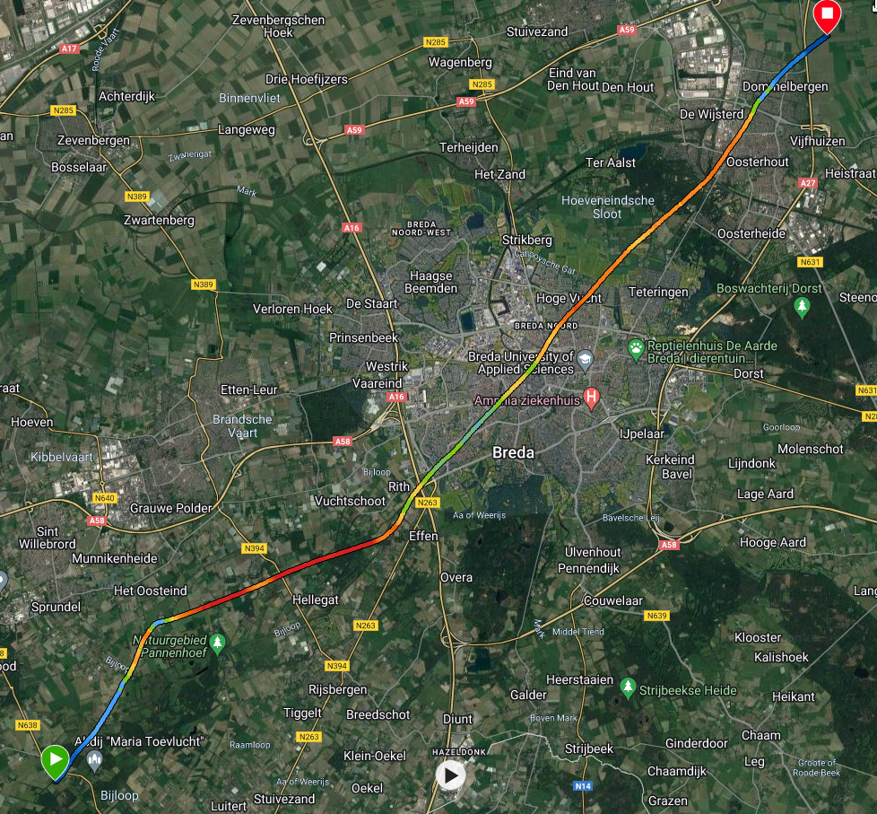

.. Learning pycharm documentation master file, created by
   sphinx-quickstart on Fri Dec 23 12:07:03 2022.
   You can adapt this file completely to your liking, but it should at least
   contain the root `toctree` directive.

Welcome to test documentation!
============================================
Hello world!
Here is a line to test github hooks.

   .. caution::
      This is a caution!

   .. danger::
      This is a danger!

   .. tip::
      This is a tip!

   .. note::
      This is a note!

.. toctree::
   :maxdepth: 2
   :hidden:
   :caption: Contents:

   justlogic
   justcode

